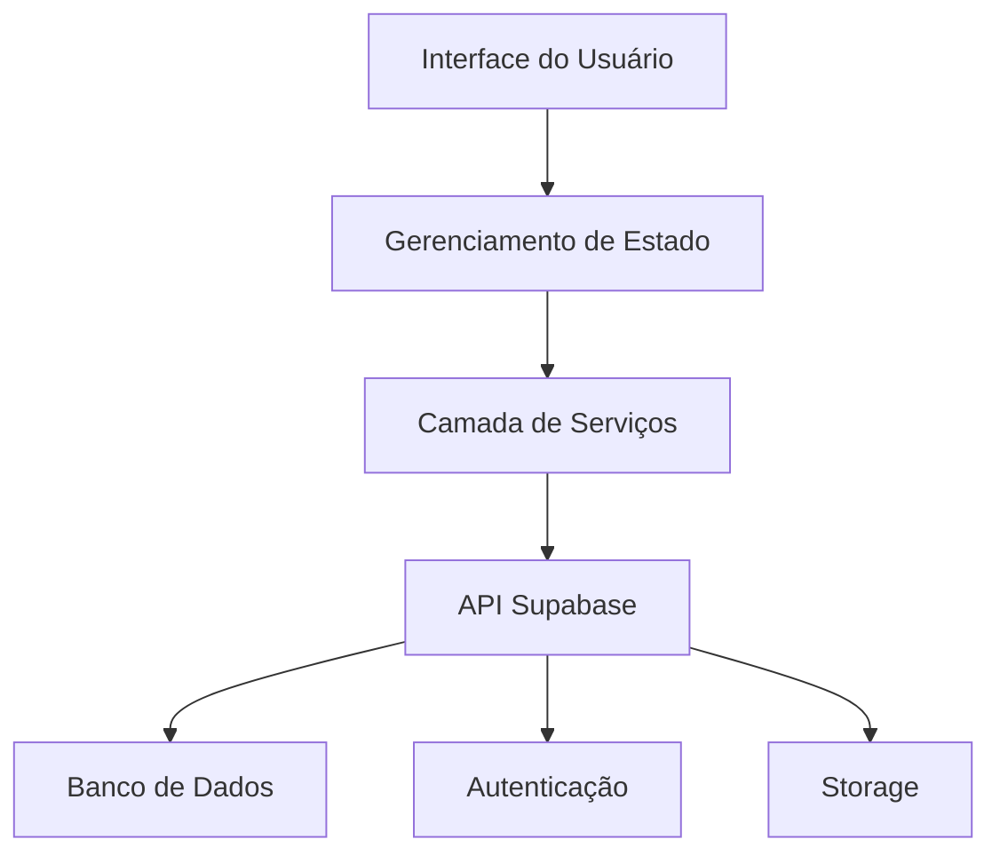
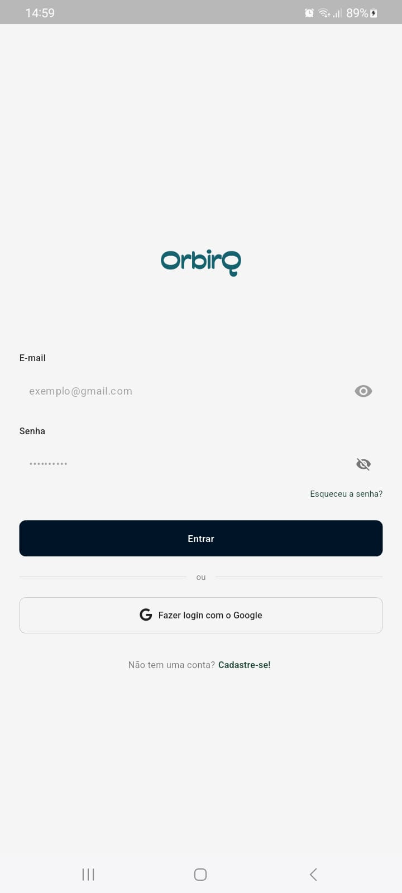
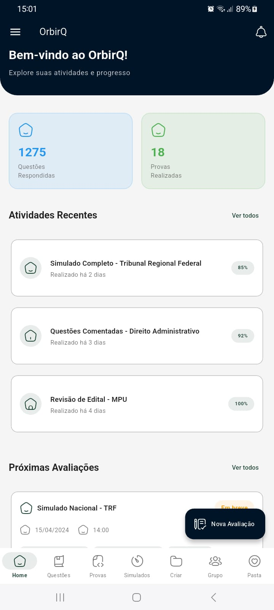
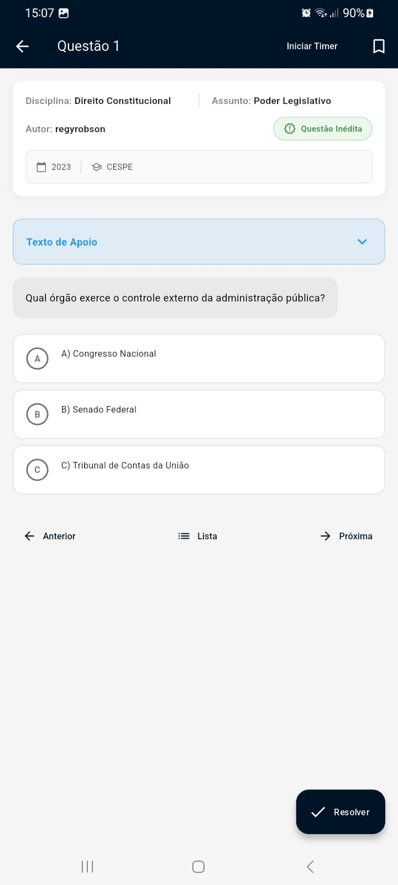

# <div align="center">🎓 ORBIRQ</div>

<div align="center">


### _Transformando a Educação através da Tecnologia_

[](https://github.com/orbirq/orbirq)
[](https://github.com/orbirq/orbirq/releases)
[](https://flutter.dev)
[](https://supabase.io)
[](LICENSE.md)
[](https://discord.gg/orbirq)

### ⚠️ Projeto em Desenvolvimento

Este projeto está atualmente em fase de desenvolvimento ativo. Algumas funcionalidades podem estar incompletas ou sujeitas a mudanças.

#### Estado Atual:
- 🚧 Interface do usuário em construção
- 🔄 Sistema de autenticação em implementação
- 📝 Documentação sendo elaborada

[Documentação](https://docs.orbirq.com) · [Acompanhe o Progresso](https://github.com/orbirq/orbirq/projects)

</div>

---

## 🌟 Destaques

<div align="center">

</div>

### Por que escolher o Orbirq?

🚀 **Inovação Educacional**
- Interface intuitiva inspirada em jogos
- Gamificação do aprendizado
- Sistema de recompensas e conquistas

🎯 **Foco no Aprendizado**
- Trilhas personalizadas de estudo
- Acompanhamento em tempo real
- Análise de desempenho com IA

🤝 **Colaboração**
- Chat em tempo real
- Videoconferências integradas
- Compartilhamento de recursos

## 📱 Interface Moderna

<div align="center">
<table>
  <tr>
    <td></td>
    <td></td>
  </tr>
  <tr>
    <td align="center">🌙 Modo Escuro</td>
    <td align="center">☀️ Modo Claro</td>
  </tr>
</table>
</div>

## 🎯 Recursos por Perfil

### 👨‍🎓 Alunos
| Recurso | Descrição |
|---------|-----------|
| 📊 Dashboard | Visão geral personalizada de atividades e progresso |
| 📝 Atividades | Sistema inteligente de organização de tarefas |
| 🏆 Conquistas | Gamificação do aprendizado com recompensas |
| 📱 App Mobile | Acesso total via dispositivos móveis |

### 👨‍🏫 Professores
| Recurso | Descrição |
|---------|-----------|
| 📈 Analytics | Análise detalhada do desempenho da turma |
| 🎯 Metas | Definição e acompanhamento de objetivos |
| 📊 Relatórios | Geração automática de relatórios |
| 🤖 IA Assistant | Auxílio na criação de conteúdo |

## 🛠️ Stack Tecnológica

<div align="center">

### Frontend
[](https://flutter.dev)
[](https://pub.dev/packages/get)
[](https://pub.dev/packages/provider)

### Backend
[](https://supabase.io)
[](https://www.postgresql.org)

### DevOps
[](https://github.com/features/actions)
[](https://firebase.google.com)

</div>

## 📊 Arquitetura



## 🚀 Começando

### Pré-requisitos

```bash
# Verifique a versão do Flutter (3.19.0 ou superior)
flutter --version

# Verifique as dependências
flutter doctor
```

### Configuração do Ambiente

1. **Clone e Instale**
```bash
# Clone o repositório
git clone https://github.com/orbirq/orbirq.git

# Entre no diretório
cd orbirq

# Instale as dependências
flutter pub get
```

2. **Configure o Supabase**
```bash
# Copie o arquivo de exemplo
cp .env.example .env

# Configure suas credenciais no .env
SUPABASE_URL=sua_url
SUPABASE_ANON_KEY=sua_chave
```

3. **Execute o App**
```bash
# Modo debug
flutter run

# Modo release
flutter run --release
```

## 📱 Screenshots

<div align="center">
<table>
  <tr>
    <td></td>
    <td></td>
    <td></td>
  </tr>
  <tr>
    <td align="center">Login Intuitivo</td>
    <td align="center">Dashboard Personalizado</td>
    <td align="center">Questao</td>
  </tr>
</table>
</div>

## 📈 Métricas e Conquistas

<div align="center">

### Downloads


### Avaliações


### Prêmios
🏆 **Melhor App Educacional 2024**
🌟 **Destaque Google Play**
🎖️ **Top 10 Apps Educacionais**

</div>

## 🗺️ Próximos Passos

<div align="center">

| Em Desenvolvimento | Planejado | Futuro |
|-------------------|-----------|---------|
| 🔐 Sistema de Auth | 📊 Dashboard | 🎥 Videoconferência |
| 📱 Interface Base | 🎯 Atividades | 🎮 Gamificação |
| 📝 Documentação | 👥 Perfis | 🌐 Modo Offline |

</div>

## 🤝 Contribuindo

Adoramos receber contribuições! Veja nosso [Guia de Contribuição](CONTRIBUTING.md) para começar.

### Fluxo de Trabalho

1. 🍴 Fork o projeto
2. 🔄 Sincronize com o repositório principal
3. 👨‍💻 Desenvolva suas alterações
4. 🧪 Teste tudo
5. 📝 Atualize a documentação
6. 🔍 Abra um PR

## 📞 Suporte

<div align="center">

[](https://discord.gg/orbirq)
[](https://wa.me/message/ORBIRQ)
[](mailto:suporte@orbirq.com)

</div>

## 📄 Licença

Copyright © 2024 Orbirq

Este projeto está licenciado sob a Licença MIT - veja o arquivo [LICENSE.md](LICENSE.md) para detalhes.

---

<div align="center">

### Feito com 💚 pela Equipe Orbirq

[](https://orbirq.com)
[](https://blog.orbirq.com)
[](https://twitter.com/OrbirqApp)

[Política de Privacidade](https://orbirq.com/privacy) · [Termos de Uso](https://orbirq.com/terms) · [Status](https://status.orbirq.com)

</div>

---

<div align="center">

### Desenvolvido com ❤️ por Regy Robson

[](https://www.instagram.com/llippe.r/)
[](https://www.linkedin.com/in/fepink/)
[](https://wa.me/55992801698)

[Website](https://orbirq.com) · [Blog](https://blog.orbirq.com) · [Status](https://status.orbirq.com)

</div>

## 📱 Demonstração do Aplicativo

<div align="center">

https://github.com/orbirq/orbirq/blob/main/github/video/video.mp4

### ▶️ Preview das Funcionalidades

O vídeo acima demonstra as principais funcionalidades já implementadas:
- 🔐 Sistema de login/registro
- 📱 Interface principal
- 📝 Visualização de questões
- 🎨 Design moderno e intuitivo

> 💡 Este é um projeto em desenvolvimento ativo, novas funcionalidades estão sendo adicionadas constantemente.

</div>